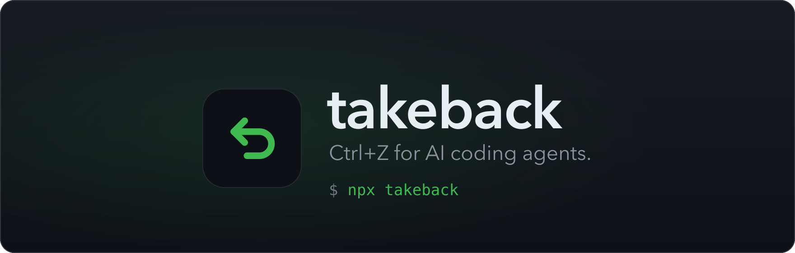
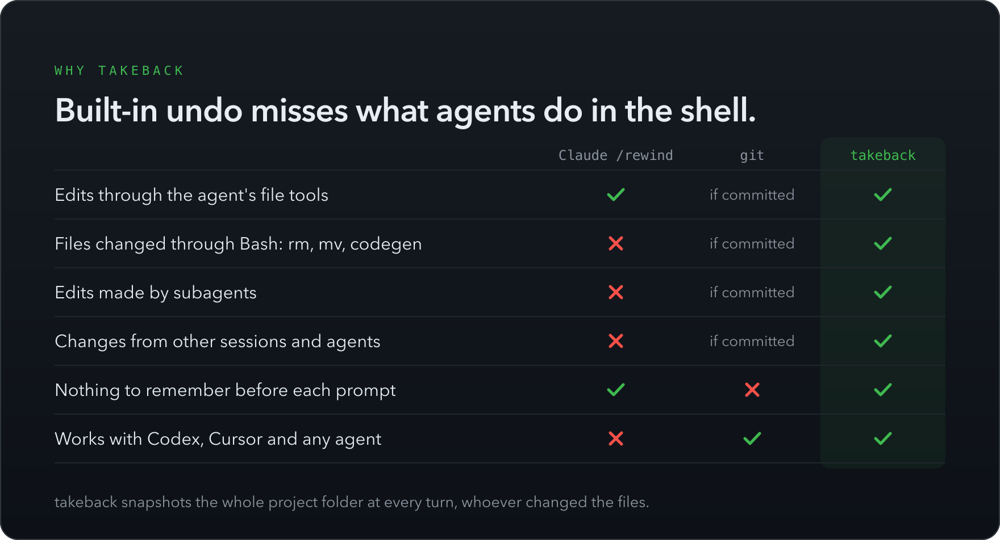
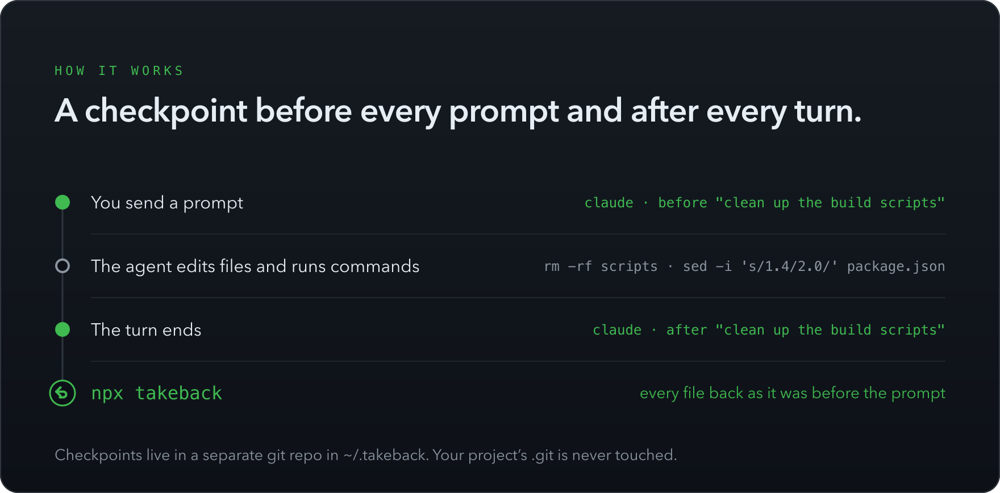
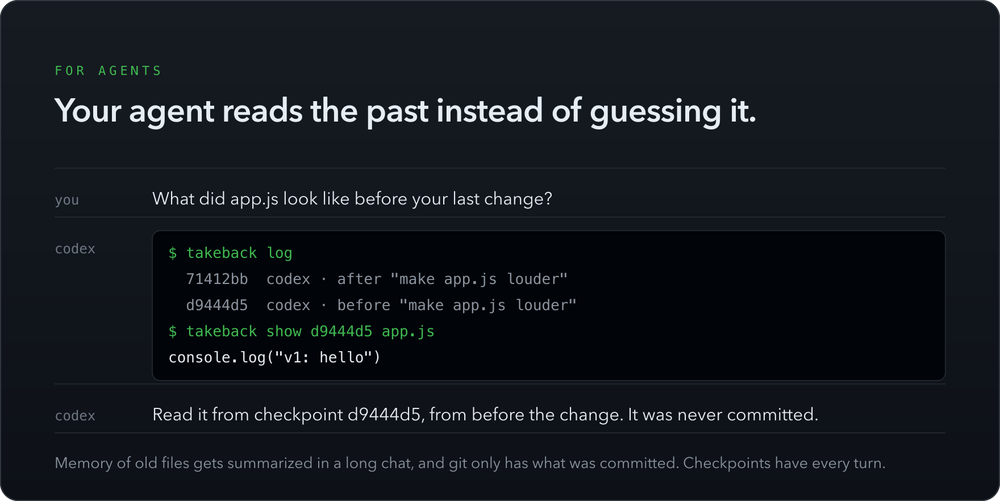

<div align="center">



**Your agent ran `rm -rf`, rewrote 40 files, or "fixed" the wrong thing.<br>
One command puts it all back, including what it changed through Bash.**

[](https://www.npmjs.com/package/takeback)
[](https://github.com/hichipli/takeback/actions/workflows/ci.yml)
[](package.json)
[](package.json)
[](LICENSE)

[Quick start](#quick-start) · [Why](#why-takeback) · [How it works](#how-it-works) · [Commands](#commands) · [For agents](#your-agent-can-use-it-too) · [FAQ](#faq) · [简体中文](README.zh-CN.md)


</div>

## Quick start

Set it up once. From then on, Claude Code and Codex save a checkpoint before every prompt and after every turn, in every project:

```bash
npx takeback init
```

When an agent breaks something, run this in the project folder. Add `-n` to see what it would do first:

```bash
npx takeback
```

> [!NOTE]
> Codex runs new hooks only after you approve them. Run `/hooks` in Codex once, or open Hooks in the ChatGPT app, and trust the two listed under takeback.

## Why takeback



- **It catches what built-in undo misses.** Claude Code's `/rewind` skips files changed through Bash, most subagents and other sessions ([docs](https://code.claude.com/docs/en/checkpointing#limitations)), and the Codex CLI [dropped `/undo`](https://github.com/openai/codex/issues/9203).
- **One setup for every project and agent.** `init` covers Claude Code and Codex in the terminal, desktop app or IDE. [`takeback watch`](#where-it-works) covers everything else.
- **It can't make things worse.** Every take back saves where you are first. Your `.git` is never touched, and files your `.gitignore` protects, like `.env`, are never deleted.
- **Small enough to read.** About 900 lines in [two files](#read-the-code), zero dependencies, nothing leaves your machine.

## How it works



- Two hooks per agent, one before every prompt and one after every turn. The plugins register them in [`hooks/hooks.json`](hooks/hooks.json); for Claude Code without the plugin, `init` writes the same two into `~/.claude/settings.json`. Each takes about 0.1 s.
- Checkpoints are commits in a separate git repository under `~/.takeback/`. Your project's `.git`, branches, index and stash are never touched, and the project doesn't need to be a git repo.
- It follows your `.gitignore` and always skips `node_modules`, `.venv` and `__pycache__`.
- Hooks don't start on a folder that isn't a git repo and holds more than 5,000 files or 500 MB, such as `~/Downloads`. Run `takeback save` there to start anyway.
- Checkpoints older than 30 days are dropped automatically, the same retention Claude Code uses for its own.
- No daemon, no account, no telemetry.

## Commands

Shown without `npx`; add it if you haven't installed takeback globally. The plugin commands link to what they tell the agent.

| You want to | Terminal | Claude Code plugin |
| --- | --- | --- |
| Undo the agent's last turn | `takeback` | [`/takeback:undo`](claude-skills/undo/SKILL.md) |
| See what that would change first | `takeback -n` | `/takeback:undo -n` |
| Go back one more turn | `takeback` again | `/takeback:undo` again |
| Undo the last turn for one file only | `takeback src/app.ts` | `/takeback:undo src/app.ts` |
| See every checkpoint | `takeback log` | [`/takeback:log`](claude-skills/log/SKILL.md) |
| Jump to any checkpoint, or redo | `takeback to 3f9c2a1` | [`/takeback:to 3f9c2a1`](claude-skills/to/SKILL.md) |
| See the last turn as a patch | `takeback diff` | [`/takeback:diff`](claude-skills/diff/SKILL.md) |
| See a file as it was at a checkpoint | `takeback show 3f9c2a1 src/app.ts` | [Ask Claude](claude-skills/checkpoints/SKILL.md) |
| Save a checkpoint by hand | `takeback save "before the refactor"` | |

Every take back prints how to undo it, so going back too far never loses work.

```console
$ takeback log
  42f4f3e  just now        takeback to 966e3c5 · 3 files
  bb9958d  2 minutes ago   claude · after "clean up the build scripts" · 3 files
  966e3c5  9 minutes ago   claude · after "add a release script" · 2 files
```

## Your agent can use it too



"Go back to the version from before" is hard for an agent: in a long conversation its memory of earlier files gets summarized, and git only has what was committed. Checkpoints hold every turn exactly, and an agent reads them the way you do:

```bash
takeback log                        # which turn was which
takeback show 3f9c2a1 src/app.ts    # a file exactly as it was
takeback diff 3f9c2a1               # everything that changed since
```

With the plugins, the agent looks there on its own and restores only when you ask: see the skill for [Claude Code](claude-skills/checkpoints/SKILL.md) and for [Codex](codex-skills/checkpoints/SKILL.md). Reading needs no write access, so it works inside Codex's sandbox too. Any other agent can run the same commands when you tell it to.

## Where it works

takeback protects the files on your computer that coding agents change.

| Where you run the agent | Setup |
| --- | --- |
| Claude Code in the terminal, the Claude desktop app (Code tab), or VS Code / JetBrains | `npx takeback init`, or the [plugin](#plugins) |
| Codex in the terminal or the ChatGPT desktop app | `npx takeback init` installs the [plugin](#plugins). Approve its two hooks once with `/hooks`; until then Codex skips them. |
| Cursor, Windsurf, Gemini CLI, OpenCode, Aider, Cline, your own scripts: anything that edits files in a folder | Keep `npx takeback watch` running in that folder. It saves a checkpoint 1.5 s after files stop changing. |
| Claude Code on the web, Codex cloud tasks and other cloud agents | Not covered: those files live on the provider's machines, not yours. |
| Plain chat in ChatGPT, Claude and other apps | Not needed: chat doesn't change files on your computer. If you run `init` anyway, it finds no coding agent and changes nothing. |

## Plugins

takeback is also a plugin for Claude Code and for Codex, so each agent lists its hooks by name. Both run takeback's TypeScript source directly and need Node 22.18 or newer.

**Claude Code.** Install it inside Claude Code to get the same checkpoints plus the [slash commands](#commands), and Claude sees what was taken back:

```text
/plugin install takeback --marketplace hichipli/takeback
```

If you also ran `npx takeback init`, the plugin takes over for Claude Code and the hooks from `init` stand down.

<details>
<summary>On Claude Code older than 2.1.275</summary>

```text
/plugin marketplace add hichipli/takeback
```

```text
/plugin install takeback@takeback
```

</details>

**Codex.** `npx takeback init` installs the plugin when the `codex` command is available. Then approve its two hooks once, in `/hooks` or the ChatGPT app's Hooks page, where they're listed under takeback.

<details>
<summary>Install the Codex plugin yourself</summary>

```bash
codex plugin marketplace add hichipli/takeback
```

```bash
codex plugin add takeback@takeback
```

</details>

## FAQ

<details>
<summary><b>Does takeback replace git?</b></summary>

No. Commit what you want to keep. takeback is the safety net for the minutes between commits, when an agent is changing many files at once.

</details>

<details>
<summary><b>What if the agent already committed?</b></summary>

takeback puts the files back and leaves git history alone, so they show up as uncommitted changes. It says so whenever the branch or commit moved since the checkpoint. To undo the commit itself, use `git revert` or `git reset`.

</details>

<details>
<summary><b>What can't it take back?</b></summary>

Files your `.gitignore` excludes (such as `.env` or `dist/`), anything outside the project folder, and side effects like database writes, package installs or `git push`.

</details>

<details>
<summary><b>Does it slow my agent down?</b></summary>

The first checkpoint of a project stores a compressed copy of it, which takes a few seconds on large projects (3.6 s for an 850-file app). After that each hook call takes about 0.1 s.

</details>

<details>
<summary><b>How much disk does it use?</b></summary>

Git stores each version of a file once, compressed. Old checkpoints go after 30 days. To free space now, run `takeback prune`; `takeback prune --keep 7d` keeps only the last week. Prune also deletes checkpoints of folders that no longer exist.

</details>

<details>
<summary><b>Why does takeback say there are no checkpoints?</b></summary>

Either setup hasn't run (`npx takeback init`), Codex hasn't been allowed to run the hooks yet (`/hooks` in Codex), or the folder is a big one that isn't a git repo (`takeback save` starts it). takeback prints these hints itself.

</details>

<details>
<summary><b>How do I update?</b></summary>

`npx takeback@latest init` updates everything, the Claude Code and Codex plugins included. If the `claude` or `codex` command isn't on your PATH, it tells you how to update that plugin from the agent instead. If an update changes the hooks, Codex asks you to approve them again.

</details>

<details>
<summary><b>How do I uninstall?</b></summary>

`npx takeback init --remove` removes the hooks and the Codex plugin. Remove the Claude Code plugin with `/plugin uninstall takeback@takeback`, then delete `~/.takeback`.

</details>

## Read the code

Read it before you run it. There's not much:

| File | What it does |
| --- | --- |
| [`src/takeback.ts`](src/takeback.ts) | The checkpoint store: save, take back, diff, show and prune |
| [`src/cli.ts`](src/cli.ts) | Commands, the hook entry point and `init` |
| [`hooks/hooks.json`](hooks/hooks.json) | The two hooks both plugins register |
| [`claude-skills/`](claude-skills/) | The Claude Code slash commands and the skill for reading checkpoints |
| [`codex-skills/`](codex-skills/) | The same skill for Codex |
| [`test/takeback.test.ts`](test/takeback.test.ts) | 24 tests, run on Linux, macOS and Windows |

## Roadmap

- [ ] Native hooks for Gemini CLI, OpenCode and DeepSeek Harness
- [ ] Interactive timeline picker

## Contributing

Issues and pull requests are welcome; start with [CONTRIBUTING.md](CONTRIBUTING.md). If takeback saved your afternoon, a ⭐ helps other people find it.

## License

[MIT](LICENSE)
