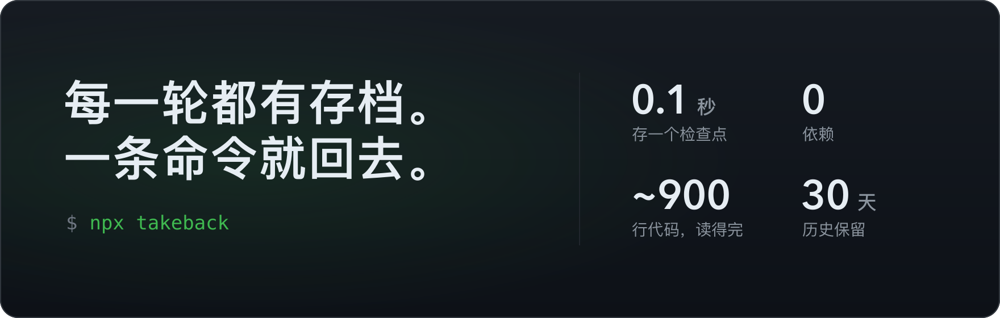
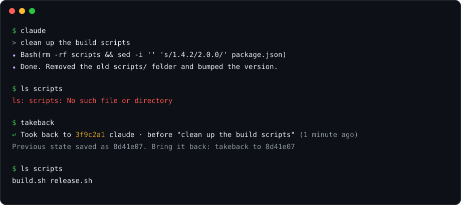
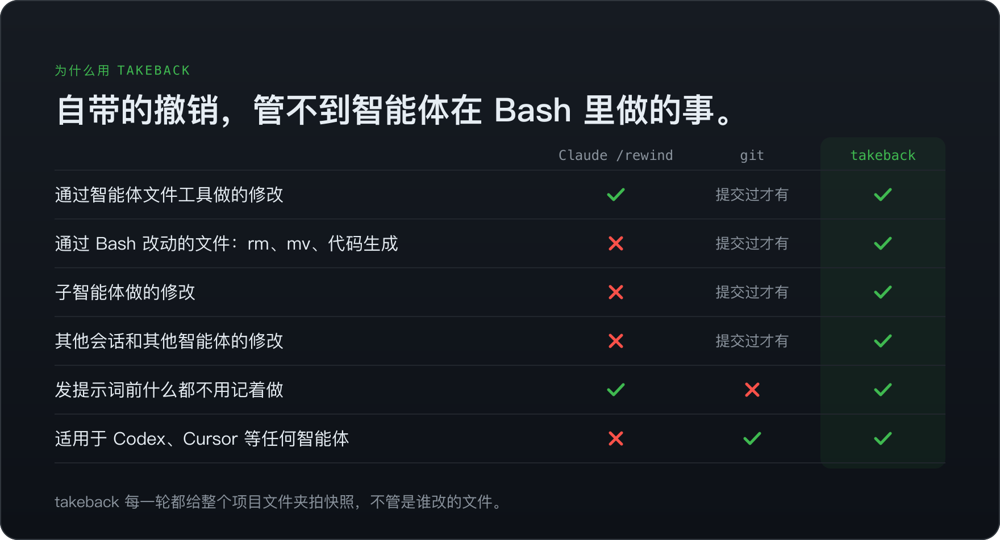
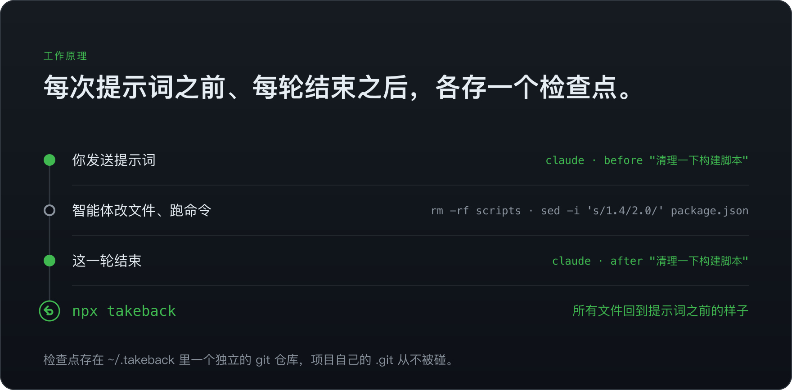
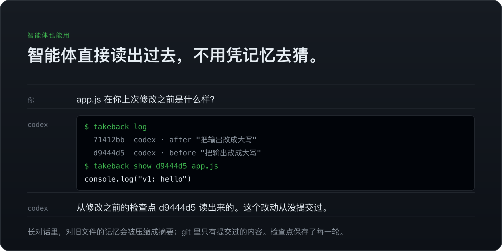

<div align="center">


# takeback

**AI 编程智能体的 Ctrl+Z。**

智能体跑了 `rm -rf`、改坏了 40 个文件，或者"修好"了不该动的地方？<br>
一条命令全部恢复，包括它通过 Bash 改动的文件。

[](https://github.com/hichipli/takeback/actions/workflows/ci.yml)
[](https://www.npmjs.com/package/takeback)
[](LICENSE)

[English](README.md) · 简体中文



**支持终端、桌面 App 和 IDE 里的 Claude Code 和 Codex。**<br>
**其他智能体用 `takeback watch`。**<br>
<sub>从不碰你的 `.git`，从不删除 `.gitignore` 保护的文件，数据不离开你的电脑。</sub>



</div>

## 快速开始

只需设置一次。之后在所有项目里，Claude Code 和 Codex 都会在每次发送提示词之前、每轮结束之后各保存一个检查点：

```bash
npx takeback init
```

智能体把东西改坏了，就在项目文件夹里运行下面这条。想先看看会改什么，加 `-n`：

```bash
npx takeback
```

> [!NOTE]
> Codex 只运行你批准过的钩子。请在 Codex 里运行一次 `/hooks`（或打开 ChatGPT App 的 Hooks 页面），批准 takeback 下面的两个钩子。

## 为什么用 takeback



- **补上自带撤销的漏洞。** Claude Code 的 `/rewind` 不管通过 Bash 改动的文件、大多数子智能体和其他会话的修改（[官方文档](https://code.claude.com/docs/en/checkpointing#limitations)），Codex CLI 则[去掉了 `/undo`](https://github.com/openai/codex/issues/9203)。
- **一次设置，所有项目、所有智能体。** `init` 覆盖终端、桌面 App 和 IDE 里的 Claude Code 和 Codex。其他工具用 [`takeback watch`](#在哪里能用)。
- **不会让情况更糟。** 每次撤销前都先保存当前状态。从不碰你的 `.git`，也从不删除 `.gitignore` 保护的文件，比如 `.env`。
- **小到可以读完。** [两个文件](#读代码)，约 900 行，零依赖，数据不离开你的电脑。

## 工作原理



- 每个智能体两个钩子：每次提示词之前一个，每轮结束之后一个。插件在 [`hooks/hooks.json`](hooks/hooks.json) 里注册它们；没装 Claude Code 插件时，`init` 把同样两个钩子写进 `~/.claude/settings.json`。每次约 0.1 秒。
- 检查点是 `~/.takeback/` 下一个独立 git 仓库里的提交。项目自己的 `.git`、分支、暂存区和 stash 都不会被碰，项目本身也不需要是 git 仓库。
- 遵守你的 `.gitignore`，并始终跳过 `node_modules`、`.venv`、`__pycache__`。
- 不是 git 仓库、并且超过 5,000 个文件或 500 MB 的文件夹（比如 `~/Downloads`），钩子不会自动开始存检查点。想在这种文件夹里用，运行一次 `takeback save` 即可。
- 超过 30 天的检查点会自动清理，和 Claude Code 自己的保留期一样。
- 没有后台进程，没有账号，没有遥测。

## 命令

下面的命令省略了 `npx`，没有全局安装的话请加上。插件命令链接到它们给智能体的说明。

| 你想 | 终端 | Claude Code 插件 |
| --- | --- | --- |
| 撤销智能体的上一轮 | `takeback` | [`/takeback:takeback`](claude-skills/takeback/SKILL.md) |
| 先看看会改什么 | `takeback -n` | `/takeback:takeback -n` |
| 再往前退一轮 | 再运行一次 `takeback` | 再运行一次 `/takeback:takeback` |
| 只撤销上一轮对某个文件的改动 | `takeback src/app.ts` | `/takeback:takeback src/app.ts` |
| 查看所有检查点 | `takeback log` | [`/takeback:takeback-log`](claude-skills/takeback-log/SKILL.md) |
| 跳到任意检查点，或者重做 | `takeback to 3f9c2a1` | [`/takeback:takeback-to 3f9c2a1`](claude-skills/takeback-to/SKILL.md) |
| 以 patch 形式查看上一轮的改动 | `takeback diff` | [`/takeback:takeback-diff`](claude-skills/takeback-diff/SKILL.md) |
| 查看某个文件在检查点时的内容 | `takeback show 3f9c2a1 src/app.ts` | [直接问 Claude](claude-skills/takeback-checkpoints/SKILL.md) |
| 手动保存一个检查点 | `takeback save "重构之前"` | |

每次撤销都会告诉你怎么撤回这次撤销，所以退过头也不会丢东西。

```console
$ takeback log
  42f4f3e  just now        takeback to 966e3c5 · 3 files
  bb9958d  2 minutes ago   claude · after "clean up the build scripts" · 3 files
  966e3c5  9 minutes ago   claude · after "add a release script" · 2 files
```

## 智能体也能用



"回到之前那个版本"对智能体来说其实很难：对话一长，它对早先文件的记忆会被压缩成摘要；git 里也只有提交过的内容。检查点精确保存了每一轮，智能体可以像你一样直接读取：

```bash
takeback log                        # 哪个检查点对应哪一轮
takeback show 3f9c2a1 src/app.ts    # 某个文件当时的原样
takeback diff 3f9c2a1               # 从那以后改了什么
```

装了插件后，智能体会自己想到去查检查点，并且只在你要求时才恢复，见 [Claude Code](claude-skills/takeback-checkpoints/SKILL.md) 和 [Codex](codex-skills/takeback-checkpoints/SKILL.md) 的技能说明。读取不需要写权限，在 Codex 的沙盒里也能用。其他智能体在你告诉它之后，也能运行同样的命令。

## 在哪里能用

takeback 保护的是编程智能体在你电脑上改动的文件。

| 你在哪里用智能体 | 设置 |
| --- | --- |
| Claude Code：终端、Claude 桌面 App（Code 标签页）、VS Code / JetBrains 插件 | `npx takeback init`，或者装[插件](#插件) |
| 终端或 ChatGPT 桌面 App 里的 Codex | `npx takeback init` 会安装[插件](#插件)。用 `/hooks` 批准一次它的两个钩子，批准之前 Codex 会跳过它们 |
| Cursor、Windsurf、Gemini CLI、OpenCode、Aider、Cline、你自己的脚本：任何会改文件夹里文件的工具 | 在那个文件夹里保持运行 `npx takeback watch`，文件停止变化 1.5 秒后自动存检查点 |
| 网页版 Claude Code、Codex 云端任务等云端智能体 | 不适用：文件在服务商的机器上，不在你的电脑上 |
| ChatGPT、Claude 等应用里的普通聊天 | 不需要：聊天不会改你电脑上的文件。就算运行了 `init`，它也找不到编程智能体，什么都不会改 |

## 插件

takeback 也是 Claude Code 和 Codex 的插件，两边都会用名字列出它的钩子。两个插件都直接运行 takeback 的 TypeScript 源码，需要 Node 22.18 或更新版本。

**Claude Code。** 在 Claude Code 里安装，同样会自动存检查点，另外多了[斜杠命令](#命令)，而且 Claude 能看到恢复了什么：

```text
/plugin install takeback --marketplace hichipli/takeback
```

如果你之前运行过 `npx takeback init`，Claude Code 这边会交给插件，`init` 装的钩子自动让位。

<details>
<summary>Claude Code 低于 2.1.275 时</summary>

```text
/plugin marketplace add hichipli/takeback
```

```text
/plugin install takeback@takeback
```

</details>

**Codex。** 只要电脑上有 `codex` 命令，`npx takeback init` 会自动装好插件。之后在 `/hooks` 或 ChatGPT App 的 Hooks 页面里批准一次它的两个钩子，它们列在 takeback 下面。

<details>
<summary>自己安装 Codex 插件</summary>

```bash
codex plugin marketplace add hichipli/takeback
```

```bash
codex plugin add takeback@takeback
```

</details>

## 常见问题

<details>
<summary><b>takeback 能代替 git 吗？</b></summary>

不能。想保留的东西请提交。takeback 是两次提交之间的安全网，专门应对智能体一口气改很多文件的时候。

</details>

<details>
<summary><b>智能体已经提交了怎么办？</b></summary>

takeback 只恢复文件，不动 git 历史，所以恢复后的文件会显示为未提交的改动。只要从那个检查点之后分支或提交变了，它都会提示。想撤销提交本身，请用 `git revert` 或 `git reset`。

</details>

<details>
<summary><b>哪些东西撤销不了？</b></summary>

`.gitignore` 排除的文件（比如 `.env`、`dist/`）、项目文件夹以外的东西，以及数据库写入、安装依赖、`git push` 这类副作用。

</details>

<details>
<summary><b>会拖慢智能体吗？</b></summary>

项目的第一个检查点会存一份压缩副本，大项目要几秒（一个 850 个文件的应用用了 3.6 秒）。之后每次钩子调用约 0.1 秒。

</details>

<details>
<summary><b>占多少磁盘？</b></summary>

git 对每个文件版本只存一份并压缩。旧检查点 30 天后自动清理。想马上释放空间就运行 `takeback prune`，`takeback prune --keep 7d` 只保留最近一周。prune 也会删除已经不存在的文件夹的检查点。

</details>

<details>
<summary><b>为什么 takeback 说没有检查点？</b></summary>

可能是还没设置（`npx takeback init`），可能是 Codex 还没批准钩子（在 Codex 里运行 `/hooks`），也可能这是一个不是 git 仓库的大文件夹（运行 `takeback save` 开始）。takeback 自己也会打印这些提示。

</details>

<details>
<summary><b>怎么更新？</b></summary>

运行 `npx takeback@latest init`，会一并更新 Claude Code 和 Codex 的插件。如果电脑上没有 `claude` 或 `codex` 命令，它会告诉你怎么在对应的智能体里手动更新。如果更新改动了钩子，Codex 会请你重新批准一次。

</details>

<details>
<summary><b>怎么卸载？</b></summary>

`npx takeback init --remove` 会移除钩子和 Codex 插件。Claude Code 插件用 `/plugin uninstall takeback@takeback` 移除，最后删掉 `~/.takeback`。

</details>

## 读代码

运行之前可以先读一遍，内容不多：

| 文件 | 做什么 |
| --- | --- |
| [`src/takeback.ts`](src/takeback.ts) | 检查点仓库：保存、撤销、diff、show 和 prune |
| [`src/cli.ts`](src/cli.ts) | 命令、钩子入口和 `init` |
| [`hooks/hooks.json`](hooks/hooks.json) | 两个插件共用的两个钩子 |
| [`claude-skills/`](claude-skills/) | Claude Code 的斜杠命令，以及读取检查点的技能 |
| [`codex-skills/`](codex-skills/) | Codex 用的同一个技能 |
| [`test/takeback.test.ts`](test/takeback.test.ts) | 24 个测试，在 Linux、macOS 和 Windows 上运行 |

## 路线图

- [ ] 支持 Gemini CLI、OpenCode 和 DeepSeek Harness 的原生钩子
- [ ] 交互式时间线选择器

## 参与贡献

欢迎提 issue 和 pull request，先看看 [CONTRIBUTING.md](CONTRIBUTING.md)。如果 takeback 救了你一下午，点个 ⭐ 能帮更多人找到它。

## 许可证

[MIT](LICENSE)
